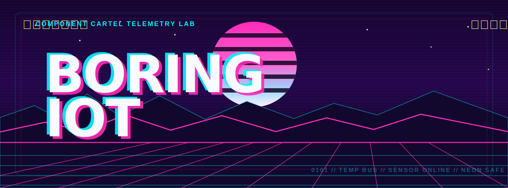

<p align="center">
  
</p>

# Boring IoT

Cyberpunk-flavoured IoT telemetry lab for environmental signal monitoring.

The project connects an ESP32-S3 device to Supabase and a React/Vite dashboard deployed on GitHub Pages. It stores historical readings, shows the latest device state, visualizes the last ~8 hours of data, and adds a short 30 minute trend forecast.

This is intentionally a fun demo, not a production weather station. The goal is to show end-to-end ownership across hardware, firmware, cloud data storage, security rules, frontend visualization, deployment, and iteration on mobile UX.

## Why It Fits DE + DS

This project is useful as a Data Engineering / Data Science portfolio piece because it is built around a real data flow:

- signal collection from physical hardware
- structured event ingestion into Postgres via Supabase REST
- historical time-series storage
- data quality constraints and device identity
- live dashboard consumption from a static frontend
- trend forecasting from recent measurements
- clear tradeoffs around security, latency, sensor accuracy, and sampling frequency

The forecast is deliberately described as a trend estimate. It is not machine learning and should not be presented as a validated prediction model.

## Stack

- ESP32-S3 device
- environmental telemetry sensor
- on-board RGB status LED
- Supabase Postgres + REST API + Row Level Security
- React + Vite
- GitHub Pages

## Architecture

```text
Telemetry sensor
  -> ESP32-S3 firmware
  -> Supabase REST API
  -> temperature_readings table
  -> React/Vite dashboard
  -> GitHub Pages
```

The ESP32-S3 reads telemetry values, applies a configurable calibration offset, and uploads readings at a fixed interval. The dashboard reads public telemetry history and renders live cards, statistics, and a short-term trend forecast.

## Features

- Live telemetry cards
- device metadata
- 8 hour history view, based on 960 readings at a 30 second upload interval
- 30 minute damped trend forecast for temperature and pressure
- Mobile responsive cyberpunk dashboard
- Share preview metadata for link previews
- Token-protected device inserts through Supabase RLS
- archived/demo fallback when the live telemetry feed is paused
- Local firmware config files ignored by git

## Branches

- `main`: public GitHub Pages deployment
- `dev`: active development branch

## Web Dashboard

Install dependencies:

```bash
npm install
```

Run locally:

```bash
npm run dev
```

Build:

```bash
npm run build
```

Project URL:

```text
https://Majo0101.github.io/boring_iot/
```

## ESP32-S3 Setup

Copy the example config:

```text
s3/config.example.h -> s3/config.h
```

Fill in:

```cpp
#define WIFI_SSID "YOUR_WIFI_NAME"
#define WIFI_PASSWORD "YOUR_WIFI_PASSWORD"

#define SUPABASE_URL "https://your-project.supabase.co"
#define SUPABASE_KEY "YOUR_SUPABASE_PUBLISHABLE_KEY"

#define DEVICE_ID "YOUR_DEVICE_ID"
#define DEVICE_TOKEN "YOUR_DEVICE_TOKEN"
#define UPLOAD_INTERVAL_MS 30000

#define TEMPERATURE_OFFSET_C 0.0
```

Development notes:

- serial logging runs at `115200`
- the ESP32 uses a `2.4 GHz` WiFi network
- local credentials and device tokens stay in ignored config files

Required Arduino libraries:

- `Adafruit BMP280 Library`
- `Adafruit BME280 Library`
- `Adafruit Unified Sensor`
- `Adafruit NeoPixel`

The current telemetry stream focuses on temperature and pressure. Humidity is not part of this build.

## Status LED

The on-board RGB LED is used as a quick device status indicator:

- red: WiFi disconnected
- green: WiFi connected
- yellow flash: upload attempt

Brightness is controlled through `STATUS_LED_BRIGHTNESS` in `s3/config.h`.

## Supabase Data Layer

Supabase acts as the lightweight telemetry store for the dashboard. Public visitors can read dashboard data, while device writes are protected with Row Level Security and a per-device token.

The database stores timestamped readings with device identity and measured values. The full SQL setup is intentionally kept out of the public README so the repository explains the architecture without exposing the whole backend recipe.

## Forecast Method

The dashboard calculates a lightweight 30 minute trend estimate in the browser:

- reads the latest history from Supabase
- uses the most recent 60 minutes of usable data
- fits a smoothed linear trend
- dampens and clamps the result so short spikes do not explode visually
- renders the forecast as a yellow continuation of the historical temperature line

This is a practical visualization layer, not a validated data science model. For a more serious DS version, the next step would be backtesting, confidence intervals, sensor calibration, and comparison against baseline models.

## Archive Mode

If the hardware feed is paused, the dashboard keeps presenting the latest stored telemetry instead of breaking the public page. If no live data can be loaded at all, it falls back to a clearly labeled showcase dataset so the project remains presentable as a portfolio demo.

## Security Notes

- `s3/config.h` is ignored by git and must not be committed.
- The frontend uses a Supabase publishable key, which is expected for browser clients.
- Public visitors can read telemetry data.
- Inserts require `x-device-token`, which is sent by the ESP32 firmware.
- The current token approach is acceptable for a hobby demo, but a production setup should use a Supabase Edge Function, rate limiting, hashed device secrets, and direct inserts disabled for `anon`.
- The firmware currently uses `client.setInsecure()` for HTTPS transport. For production, pin/use a valid root CA certificate.

## Limitations

- humidity is not part of the current telemetry stream
- calibration matters for any physical measurement
- The 30 minute forecast is a trend estimate, not a weather model.
- GitHub Pages is static hosting, so all browser-readable config is public by design.

## Troubleshooting

`WiFi status: 6`

ESP32 is disconnected. Check SSID/password and make sure the network is 2.4 GHz.

`Supabase upload status: 201`

Insert succeeded.

`Supabase upload status: 401`

Check the Supabase publishable key.

`Supabase upload status: 403`

Check `DEVICE_TOKEN` and the Supabase token stored in `device_tokens`.

`Supabase upload status: 404`

Check Supabase URL and table name.

No Serial output:

- Board should be `ESP32S3 Dev Module`
- `USB CDC On Boot` should be enabled
- Serial Monitor should be `115200`

## License

MIT License. See [LICENSE](LICENSE).
